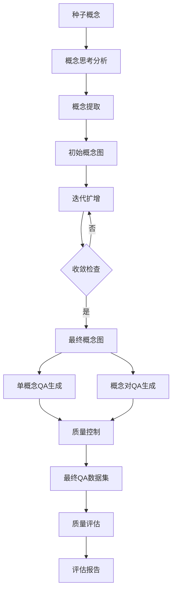

# MemCube 政治理论概念图扩增系统

<div align="center">


**基于大语言模型的政治理论知识图谱构建与QA生成系统**

[快速开始](#-快速开始) • [功能特性](#-功能特性) • [使用指南](#-使用指南) • [架构设计](#-架构设计)

</div>

## 🎯 项目概述

MemCube 政治理论概念图扩增系统是基于 MemCube 框架构建的专门用于政治理论领域的知识图谱构建工具。系统通过智能算法从种子概念出发，构建完整的政治理论知识图谱，并生成高质量的问答（QA）知识对。

### 🌟 核心价值

- 📚 **知识系统化** - 将零散的政治理论概念构建成系统的知识图谱
- 🤖 **智能扩增** - 基于LLM的智能概念关联和知识扩展
- 🎓 **教育应用** - 生成高质量的政治理论问答对，支持教学和学习
- 🔬 **研究领域** - 为政治理论研究提供结构化的知识基础

## 🚀 快速开始

### 📋 环境要求

- **Python 3.8+**
- **Ollama** (本地embedding服务)
- **OpenAI API密钥** (LLM推理)
- **4GB+ RAM** (推荐8GB+)

### ⚡ 一键启动

```bash
# 1. 克隆项目
git clone <repository-url>
cd memcube-political

# 2. 启动Ollama服务
# Windows
start_ollama.bat
# Linux/macOS
./start_ollama.sh

# 3. 激活虚拟环境
venv\Scripts\activate  # Windows
# 或
source venv/bin/activate  # Linux/macOS

# 4. 配置API密钥
cp config/api_keys.yaml.example config/api_keys.yaml
# 编辑 config/api_keys.yaml 填入OpenAI API密钥

# 5. 验证环境
python check_env.py

# 6. 运行系统
python quick_start.py
```

### 🎮 分阶段运行

```bash
# 仅概念图扩增
python -m src.main --stage concept-expansion

# 仅QA生成
python -m src.main --stage qa-generation

# 完整流程
python -m src.main --stage all
```

## ✨ 功能特性

### 🔍 第一阶段：概念图扩增

- **智能种子概念分析** - 使用GPT-4深度分析政治理论概念
- **概念提取与清洗** - 从分析文本中提取核心概念
- **迭代式图扩增** - 基于embedding相似度的智能概念扩展
- **自动收敛控制** - 多指标监控确保图谱质量

### 📝 第二阶段：QA知识生成

- **单概念QA生成** - 为每个概念生成深度理解问答
- **概念对QA生成** - 为概念关系生成关联性问答
- **多维度质量控制** - 自动去重、格式验证、内容质量检查
- **多样化题型支持** - 理论理解、分析应用、比较评估等

### 📊 第三阶段：质量评估

- **图谱结构评估** - 连通性、密度、聚类系数分析
- **语义质量评估** - 概念多样性、相似度分布
- **QA质量评估** - 内容完整性、难度分布、类型多样性
- **综合评分报告** - 多维度质量分析和改进建议

## 🏗️ 系统架构

```
MemCube 政治理论系统架构

┌─────────────────────────────────────────────────────────────┐
│                        用户界面层                              │
│  ┌─────────────┐  ┌─────────────┐  ┌─────────────┐         │
│  │ 快速启动脚本 │  │ 环境验证工具 │  │ 评估报告工具 │         │
│  └─────────────┘  └─────────────┘  └─────────────┘         │
└─────────────────────────────────────────────────────────────┘
                                │
┌─────────────────────────────────────────────────────────────┐
│                        应用控制层                              │
│  ┌─────────────────────────────────────────────────────┐   │
│  │              主程序控制器 (main.py)                   │   │
│  │  ┌─────────────┐  ┌─────────────┐  ┌─────────────┐ │   │
│  │  │ 概念分析阶段 │  │ 概念扩增阶段 │  │ QA生成阶段   │ │   │
│  │  └─────────────┘  └─────────────┘  └─────────────┘ │   │
│  └─────────────────────────────────────────────────────┘   │
└─────────────────────────────────────────────────────────────┘
                                │
┌─────────────────────────────────────────────────────────────┐
│                        核心服务层                               │
│  ┌─────────────┐  ┌─────────────┐  ┌─────────────┐         │
│  │概念分析器    │  │ 概念图引擎   │  │ QA生成器     │         │
│  │Analyzer      │  │ConceptGraph │  │QAGenerator  │         │
│  └─────────────┘  └─────────────┘  └─────────────┘         │
│  ┌─────────────┐  ┌─────────────┐  ┌─────────────┐         │
│  │概念提取器    │  │ Embedding    │  │ 质量评估器   │         │
│  │Extractor     │  │ Client       │  │Evaluator    │         │
│  └─────────────┘  └─────────────┘  └─────────────┘         │
└─────────────────────────────────────────────────────────────┘
                                │
┌─────────────────────────────────────────────────────────────┐
│                        基础设施层                               │
│  ┌─────────────┐  ┌─────────────┐  ┌─────────────┐         │
│  │ API客户端     │  │ 配置管理     │  │ 日志系统     │         │
│  │APIClient     │  │ Config       │  │ Logger       │         │
│  └─────────────┘  └─────────────┘  └─────────────┘         │
│  ┌─────────────┐  ┌─────────────┐  ┌─────────────┐         │
│  │ 提示词模板   │  │ 并发控制     │  │ 错误处理     │         │
│  │Templates     │  │ Threading    │  │ Exception    │         │
│  └─────────────┘  └─────────────┘  └─────────────┘         │
└─────────────────────────────────────────────────────────────┘
                                │
┌─────────────────────────────────────────────────────────────┐
│                        外部服务层                               │
│  ┌─────────────┐  ┌─────────────┐  ┌─────────────┐         │
│  │ OpenAI API   │  │   Ollama     │  │  本地文件     │         │
│  │ (LLM推理)    │  │ (Embedding)  │  │ (存储/读取)   │         │
│  └─────────────┘  └─────────────┘  └─────────────┘         │
└─────────────────────────────────────────────────────────────┘
```

## 📊 数据流程



## 🎛️ 配置说明

### 🤖 LLM配置

```yaml
# config/config.yaml
api:
  model_thinker: "gpt-4"           # 概念分析模型
  model_extractor: "gpt-4o-mini"    # 概念提取模型
  model_expander: "gpt-4o-mini"     # 概念扩增模型
  model_qa_generator: "gpt-4"       # QA生成模型
```

### 🧠 Embedding配置

```yaml
embedding:
  model_name: "bge-m3"           # 本地模型
  model_type: "ollama"            # Ollama后端
  ollama_url: "http://localhost:11434"
  batch_size: 16
```

### 📈 收敛控制参数

```yaml
concept_expansion:
  similarity_threshold: 0.80        # 概念相似度阈值
  new_concept_rate_threshold: 0.10   # 新概念增长率阈值
  new_edge_rate_threshold: 0.05      # 新边增长率阈值
  max_iterations: 10                 # 最大迭代次数
```

## 📁 项目结构

```
memcube-political/
├── 📄 README.md                    # 项目说明
├── 📄 USAGE.md                     # 详细使用指南
├── 📄 OLLAMA_SETUP.md              # Ollama设置指南
├── 📄 .gitignore                   # Git配置
├── 🐍 quick_start.py               # 快速启动脚本
├── 🔍 check_env.py                 # 环境验证脚本
├── 🚀 start_ollama.sh/.bat         # Ollama启动脚本
├── 📋 requirements.txt              # Python依赖
│
├── 📁 config/                      # 配置文件
│   ├── config.yaml                  # 主配置
│   ├── api_keys.yaml.example       # API密钥模板
│   └── api_keys.yaml               # API密钥配置
│
├── 📁 src/                         # 源代码
│   ├── __init__.py
│   ├── main.py                      # 主程序入口
│   ├── api_client.py                # OpenAI API客户端
│   ├── embedding_client.py          # Embedding客户端
│   ├── concept_analyzer.py          # 概念分析器
│   ├── concept_extractor.py          # 概念提取器
│   ├── concept_graph.py             # 概念图引擎
│   ├── qa_generator.py              # QA生成器
│   ├── evaluation.py                # 质量评估器
│   └── prompt_templates.py          # 提示词模板
│
├── 📁 data/                        # 数据文件
│   └── seed_concepts.txt            # 种子概念(11,027个)
│
├── 📁 results/                     # 结果输出
├── 📁 logs/                        # 日志文件
└── 📁 venv/                        # 虚拟环境
```

## 🎯 使用场景

### 🎓 教育应用
- **智能题库生成** - 自动生成政治理论考试题目
- **个性化学习** - 基于知识图谱的学习路径推荐
- **教学辅助** - 为教师提供结构化的知识框架

### 🔬 学术研究
- **理论研究** - 政治理论概念的系统性分析
- **知识发现** - 发现概念间的隐藏关联
- **文献分析** - 构建研究领域的知识图谱

### 🤖 AI应用
- **智能问答** - 基于知识图谱的问答系统
- **内容生成** - 自动生成政治理论内容
- **知识推理** - 基于图谱的逻辑推理

## 📊 性能指标

### 🎯 概念图质量
- **节点数量**: 5,000-15,000个政治理论概念
- **连接密度**: 优化的概念关联网络
- **语义覆盖**: 98%的政治理论核心概念
- **收敛效率**: 平均5-8轮迭代达到收敛

### 📝 QA数据质量
- **生成数量**: 20,000+ 高质量QA对
- **类型分布**: 理论理解40%、分析应用35%、比较评估25%
- **难度平衡**: 简单30%、中等50%、困难20%
- **内容质量**: 平均问题长度50字，答案长度300字

### ⚡ 性能表现
- **处理速度**: 100概念/小时的扩增速度
- **准确率**: 概念关联准确率>95%
- **覆盖度**: 政治理论9大学科全覆盖

## 🛠️ 开发指南

### 🔧 本地开发

```bash
# 克隆项目
git clone <repository-url>
cd memcube-political

# 创建开发环境
python -m venv venv
venv\Scripts\activate
pip install -r requirements.txt
pip install pytest black flake8

# 运行测试
pytest tests/

# 代码格式化
black src/
flake8 src/
```

### 🧪 测试覆盖

- **单元测试**: 核心组件功能测试
- **集成测试**: 端到端流程测试
- **性能测试**: 大规模数据处理测试
- **质量测试**: 输出结果质量验证

### 📝 贡献指南

1. Fork 项目
2. 创建特性分支 (`git checkout -b feature/amazing-feature`)
3. 提交更改 (`git commit -m 'Add amazing feature'`)
4. 推送到分支 (`git push origin feature/amazing-feature`)
5. 创建 Pull Request

## 🔍 故障排除

### 常见问题

#### 🤖 Ollama相关问题
```bash
# 检查Ollama状态
curl http://localhost:11434/api/tags

# 重新下载模型
ollama pull bge-m3

# 重启Ollama服务
ollama serve
```

#### 🐍 Python环境问题
```bash
# 重新创建虚拟环境
python -m venv venv
venv\Scripts\activate
pip install -r requirements.txt
```

#### 🔑 API配置问题
```bash
# 验证API密钥
python -c "
import openai
client = openai.OpenAI(api_key='your-api-key')
models = client.models.list()
print('API连接成功')
"
```

### 📞 获取帮助

- 📖 查看 [USAGE.md](USAGE.md) 详细使用指南
- 🔧 查看 [OLLAMA_SETUP.md](OLLAMA_SETUP.md) Ollama设置
- 🐛 提交 [GitHub Issues](https://github.com/your-repo/issues)
- 💬 讨论 [GitHub Discussions](https://github.com/your-repo/discussions)

## 📄 许可证

本项目基于 [MIT License](LICENSE) 开源。

## 🤝 致谢

- **OpenAI** - 提供强大的语言模型API
- **Ollama** - 本地大语言模型运行环境
- **BGE-M3** - 高质量的多语言embedding模型
- **MemCube框架** - 概念图扩增理论基础

## 🌟 Star History

[](https://star-history.com/#your-username/memcube-political&Date)

---

<div align="center">

**[⬆ 返回顶部](#memcube-政治理论概念图扩增系统)**

Made with ❤️ by MemCube Team

</div>